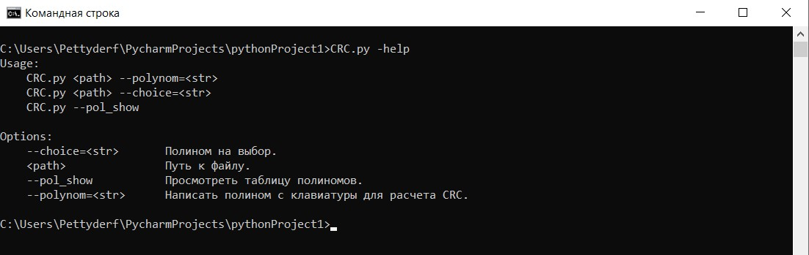
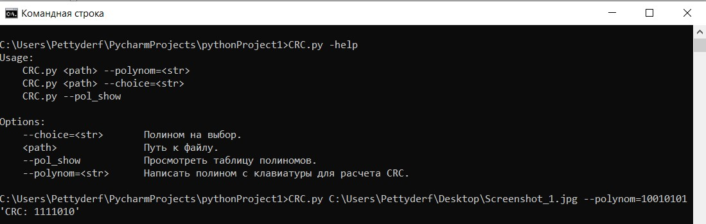
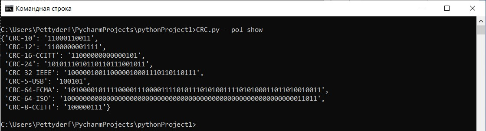
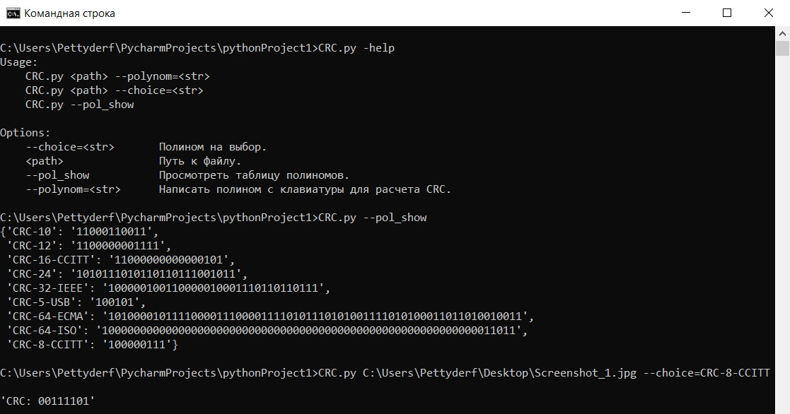

# Finding the CRC checksum.
**This code is a search for the CRC checksum of any file, where the input data is the path to this file and either a manually entered polynomial or a selected polynomial that is embedded in the program.**

<div align="center">
  


[Without using integrated polynomials](#without-using-integrated-polynomials) •  
[With using integrated polynomials](#with-using-integrated-polynomials) • 
  
</div>

#

For this software implementation to work, 2 libraries are needed: *docopt* and *pprint*.

*Pprint* is a built-in library, so its installation is not required.

*docopt* must be installed with the following console command:

```sh
pip3 install docopt
```

To display a small instruction about the program, type *-h* or *-help*.

```sh
CRC.py -help
```



# Without using integrated polynomials

To do this, simply enter the command:

```sh
CRC.py <path> --polynom=<str>
```
For example: 



# With using integrated polynomials

To find out which polynomials are embedded in the program, use the *--pol_show* command:

```sh
CRC.py --pol_show
```



Now you just need to select a polynomial and use it in the next command, where *--choice* is the variable containing the name of the polynomial:

```sh
CRC.py <path> --choice=<str>
```
For example:



#

## Authors

* **Oleg Mihalichev** - [GitHub](https://github.com/pettyderf)

## License

This project is licensed under the GNU ver.3 License.
